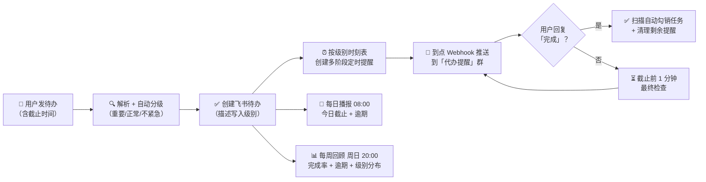

# 📒 个人备忘录 · 飞书定时提醒（Personal Memo）

> 把待办交给 AI，到点自动推送到飞书群。分级提醒、完成闭环、每日播报、每周回顾，全自动。

## ✨ 核心能力

| 能力 | 说明 |
|---|---|
| 🏷 **自动分级** | 按任务内容自动识别「重要 / 正常 / 不紧急」，也可手动指定 |
| ✅ **飞书待办** | 每个待办同步创建到飞书任务中心，统一管理、随处可查 |
| ⏰ **分级多阶段提醒** | 按级别设定不同提醒节奏，到点通过群机器人 Webhook 推送 |
| 🔁 **完成确认闭环** | 在群里回复「完成」即自动勾销待办、清理剩余提醒 |
| 📅 **每日播报** | 每天 08:00 推送今日截止 + 已逾期清单 |
| 📊 **每周回顾** | 每周日 20:00 推送完成率 / 逾期 / 级别分布 |
| 🌙 **深夜静默** | 23:00–07:00 不打扰非重要任务，最终检查例外 |
| 🔁 **失败重试** | 推送失败自动重试 1 次，不静默丢失 |
| 📦 **批量导入** | 一次粘贴多行待办，逐条自动创建 |
| 🧩 **大任务拆解** | 自动识别多步骤任务并拆成子任务 |
| ♻️ **重复任务模板** | 检测到重复任务时建议转周期提醒 |

## 🏗 工作流程



## 🎯 分级提醒时刻表

| 级别 | 提醒节奏（截止前） | 判定触发词示例 |
|---|---|---|
| 🔴 **重要** | 1 天 → 12 小时 → 4 小时 → 1 小时 → 30 分钟（共 5 次） | 必须、务必、紧急、截止、提交、交付、上线、考试、付款、客户… |
| 🟡 **正常** | 1 小时（1 次） | 无强时限词，默认兜底 |
| 🟢 **不紧急** | 30 分钟（1 次） | 有空、不急、随便、可延后… |
| ⏳ **全部级别** | 截止前 1 分钟：最终检查（未完成再推，**不受深夜静默限制**） | — |

> 时刻表可整体配置（如「重要任务改成提前 3 天 / 1 天 / 6 小时 / 1 小时」），也可单任务覆盖。

## 🕐 常驻定时任务

| 任务 | 时间 | 动作 |
|---|---|---|
| 每日任务播报 | 每天 08:00 | 推送今日截止 + 已逾期（按截止升序，最多 10 条） |
| 完成确认扫描 | 每天 08:00–23:00 每小时 | 读群新消息识别「完成」→ 勾销 → 清理剩余提醒（游标去重） |
| 每周任务回顾 | 每周日 20:00 | 统计本周完成率 / 逾期 / 级别分布 |

> ⚠️ 平台限制：定时任务最小间隔 1 小时；高峰时段（7:30–10:00 等）系统可能提前触发。

## 🚀 快速开始

对豆包说一句话即可，例如：

- 「帮我记一下，10 月 20 日 18:00 前必须交项目周报给客户」
- 「提醒我今晚 8 点开会」
- 「周一上午 10 点交采购清单（重要）；周三下午 2 点见客户；周五下班前把桌面整理一下（不紧急）」
- 「提醒后我在群里回『完成』就行」

收到提醒后，在「代办提醒」群回复 `完成` 或 `任务名 + 完成`，系统自动勾销并清理剩余提醒。

## 📂 目录结构

```text
personal-memo/
├── README.md                     # 本说明
├── SKILL.md                      # 技能定义（豆包 Agent 读取执行）
├── references/
│   └── usage-examples.md         # 典型用法示例
└── .gitignore                    # 排除敏感与运行时文件
```

## 🔧 使用前配置

仓库为开源模板，已脱敏。克隆后把以下两处替换为你自己的值：

1. **飞书 open_id**：`SKILL.md` / `references/usage-examples.md` 中的 `ou_<你的OpenID>`
2. **Webhook 文件**：本地创建 `feishu-reminder-webhook.txt`（内容为飞书自定义机器人 Webhook 地址）。模板使用相对路径 `./feishu-reminder-webhook.txt`，该文件已被 `.gitignore` 排除，**切勿提交**

## 🔒 隐私与安全

- 仓库内容已脱敏：open_id、本地路径已替换为占位符，不含个人标识
- Webhook 地址等敏感凭证**不进入仓库**（由 `.gitignore` 排除，仅存本地文件）
- 群名、任务示例等均可按需自行修改

## 📄 许可证

Apache-2.0
